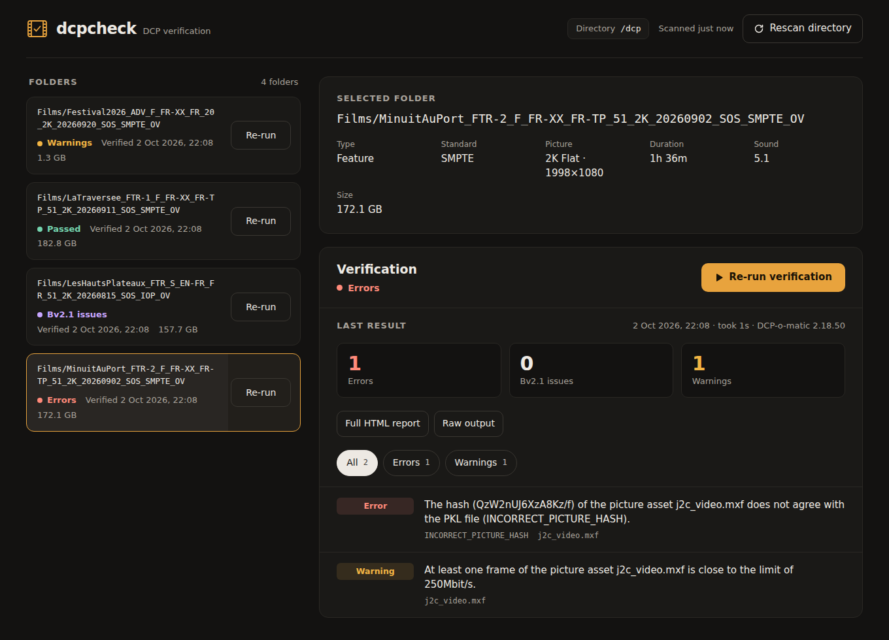

# dcpcheck-web

An unofficial web UI for verifying Digital Cinema Packages with the
**[DCP-o-matic](https://dcpomatic.com) verifier**. It runs in Docker and was
written for a Synology NAS, but it runs on any machine that has Docker.

Point it at the folder where your DCPs live, and you get a page in your browser
that lists every DCP. You can start a verification with one click, follow its
progress and read the result: critical and minor errors, Bv2.1 issues and
warnings, as reported by DCP-o-matic.



<sub>Screenshot made with sample data.</sub>

---

## Built on DCP-o-matic

dcpcheck relies entirely on [DCP-o-matic](https://dcpomatic.com), the free
and open-source DCP tool written by Carl Hetherington and its contributors:
the actual checking of a DCP is done by its verifier, and dcpcheck only starts
it and shows what it says. If this project is useful to you, consider
**[making a donation to DCP-o-matic](https://dcpomatic.com/donate)**.

> dcpcheck is **not** affiliated with DCP-o-matic or its author. Please do
> not report problems with this web interface to DCP-o-matic. Open an issue
> here instead. If you think the verifier itself is wrong about a DCP, first
> check that DCP with DCP-o-matic's own verifier on a computer, then report it
> upstream.

---

## Features

- Finds every DCP (any folder containing an `ASSETMAP` or `ASSETMAP.xml`)
  under the mounted directory and its sub-folders, rescanning every 5
  minutes or on demand.
- Shows a summary of each DCP read from its CPL: type, standard
  (SMPTE/Interop), picture container, duration, sound, size, and whether
  it needs a **KDM** (it does when the CPL lists encrypted assets). Encrypted
  DCPs carry a *KDM* flag in the list.
- Checks KDMs against an encrypted DCP: drop KDM files, or a ZIP of KDMs,
  on the page (see [Checking KDMs](#checking-kdms)).
- Sorts the list by name, size, status or date of last change.
- Runs `dcpomatic2_verify_cli` on demand, one DCP at a time (the others wait
  in a queue), with live progress and a Cancel button.
- Notices DCPs that are still being copied to the disk: while a folder keeps
  growing, it shows the copy's progress and speed instead of the Verify
  button, then verifies the DCP by itself once the copy is complete.
- Verifies new DCPs by itself as soon as a scan finds them.
- Marks a DCP without errors as **OK**, with small flags for its Bv2.1
  issues and warnings.
- Sorts the notes into **Critical errors**, **Minor errors**, **Bv2.1
  issues** and **Warnings**, with filters (see
  [Critical and minor errors](#critical-and-minor-errors)). Errors come
  first; the Bv2.1 issues and warnings come after them, hidden until you
  ask for them.
- Keeps the last result of each DCP, the verifier's full HTML report and its
  raw output.
- Mounts your DCPs **read-only**: dcpcheck never writes to them.
- Uses only the Python standard library besides DCP-o-matic: no database
  and no framework to keep up to date.

## Quick start

```sh
git clone https://github.com/audabas/dcpcheck-web.git
cd dcpcheck-web
# Edit docker-compose.yml: set the path of your DCP folder
docker compose up -d --build
```

Then open `http://<your-machine>:8080`.

Or, without compose:

```sh
docker build -t dcpcheck-web .
docker run -d --name dcpcheck -p 8080:8080 \
  -v /path/to/your/DCPs:/dcp:ro \
  -v dcpcheck-data:/data \
  --restart unless-stopped \
  dcpcheck-web
```

The build downloads the DCP-o-matic command-line package for Ubuntu 24.04
from dcpomatic.com (version 2.18.50 by default, see
[Build options](#build-options)).

## On a Synology NAS

This works on NAS models with an **x86-64** (Intel or AMD) processor, which
covers most "+" models. Check your model's CPU in Synology's spec sheets.
See [ARM](#arm) below for the others.

With **Container Manager** (DSM 7.2 and later):

1. Copy this repository to a shared folder on the NAS, for example
   `/volume1/docker/dcpcheck-web`. You can download it as a ZIP from GitHub.
2. In `docker-compose.yml`, set the left side of the `/dcp` volume to the
   folder holding your DCPs, for example `/volume1/DCP:/dcp:ro`.
3. Open **Container Manager → Project → Create**, choose that folder as the
   path and use the existing `docker-compose.yml`. Container Manager builds the
   image and starts the container.
4. Open `http://<nas-address>:8080`.

If you want the files in `data/` to belong to your DSM user instead of root,
uncomment `environment:` and `PUID`/`PGID` in `docker-compose.yml`. Run `id`
over SSH to get your values (often `1026` and `100`).

To update:

1. Replace the files in the project folder with the new version. Keep the
   `data/` folder and your own `docker-compose.yml`.
2. In **Container Manager → Project**, select the project, stop it, then
   **Action → Build** (**Créer** in French).

`docker-compose.yml` sets `pull_policy: build`, so Build rebuilds the image.
If you use your own compose file, add that line to the `dcpcheck` service.
Without it, Container Manager starts the old image again, and you have to
delete the `dcpcheck-web` image in **Container Manager → Image** before
Build.

Verification reads every byte of the DCP to check its hashes, so its speed
depends on your disks. A feature can take 15 to 30 minutes on a typical NAS.
This is why verifications run one at a time.

## Configuration

Environment variables of the container:

| Variable         | Default                 | Meaning |
|------------------|-------------------------|---------|
| `DCP_ROOT`       | `/dcp`                  | Where the DCPs are mounted inside the container. |
| `DCP_ROOT_LABEL` | same as `DCP_ROOT`      | Name shown in the header for that directory (e.g. `/volume1/DCP`). |
| `SCAN_DEPTH`     | `3`                     | How many levels of sub-folders to search for DCPs. |
| `SCAN_INTERVAL`  | `300`                   | Seconds between automatic rescans (`0` to disable). |
| `MAX_PARALLEL`   | `1`                     | Number of verifications run at the same time. |
| `COPY_QUIET`     | `20`                    | Seconds without any change after which a folder being copied is considered complete. |
| `COPY_POLL`      | `3`                     | Seconds between two measures of a folder being copied (for its speed). |
| `AUTO_VERIFY`    | `1`                     | Verify new DCPs, and DCPs whose copy is complete, by itself. Set to `0` to turn it off. |
| `KDM_SERVERS`    | *(empty)*               | Your servers, to check that KDMs are made for them: `Salle 1=<CN or dnQualifier>; Salle 2=...`. See [Checking KDMs](#checking-kdms). |
| `VERIFY_ARGS`    | *(empty)*               | Extra options for `dcpomatic2_verify_cli`, e.g. `--no-asset-hash-check`. Run `docker exec dcpcheck dcpomatic2_verify_cli --help` for the list. |
| `HTML_REPORT`    | `1`                     | Ask the verifier for its HTML report (`-o`). Set to `0` to turn it off. |
| `PUID` / `PGID`  | *(empty: root)*         | Run as this user/group. |
| `PORT`           | `8080`                  | Port the web server listens on inside the container. |
| `DATA_DIR`       | `/data`                 | Where results, logs and reports are kept. Mount a volume there. |

### Build options

| Build argument       | Default   | Meaning |
|----------------------|-----------|---------|
| `DCPOMATIC_VERSION`  | `2.18.50` | DCP-o-matic version to download. Look at [dcpomatic.com/download](https://dcpomatic.com/download) for the current one. |
| `DCPOMATIC_DL_ID`    | from the architecture | Package id on dcpomatic.com (`ubuntu-24.04-x86-cli` on amd64). |
| `DCPOMATIC_DEB_URL`  | *(empty)* | Full URL of a `.deb` to use instead. |

For example: `docker build --build-arg DCPOMATIC_VERSION=2.18.51 -t dcpcheck-web .`

If the NAS has no internet access, or the download fails, download the
**Ubuntu 24.04 CLI** package from
[dcpomatic.com/download](https://dcpomatic.com/download) yourself, put the
`.deb` in the [`deb/`](deb/) folder and build again. It is used instead of
the download.

### ARM

On arm64, the build tries the package id `ubuntu-24.04-arm-cli`. If
dcpomatic.com names its ARM package differently, pass the right id with
`--build-arg DCPOMATIC_DL_ID=...`, or put the `.deb` in `deb/`. 32-bit ARM
NAS models are not supported.

## Security

dcpcheck has **no authentication**. Anyone who can reach the port can see
your DCP names and start verifications, but cannot change, delete or download
your DCPs. Keep it on your local network. To reach it from outside, put it
behind a VPN or a reverse proxy with authentication, such as DSM's reverse
proxy with an access-control profile.

## How it works

- `app/dcpcheck/scanner.py` finds the DCP folders and reads their CPL.
- `app/dcpcheck/manager.py` keeps the queue and runs
  `dcpomatic2_verify_cli [VERIFY_ARGS] -o report.html <DCP>` for each
  verification.
- `app/dcpcheck/kdm.py` reads KDMs and compares them with the CPLs of a DCP.
- `app/dcpcheck/output.py` reads the verifier's output: stages, progress
  bar, and lines starting with `Error:`, `Bv2.1 error:` or `Warning:`. It
  also tells critical errors from minor ones.
- Results are stored in `/data/results.json`, with the raw output in
  `/data/logs/` and the verifier's HTML reports in `/data/reports/`.
- `app/static/` holds the single-page UI, in plain HTML, CSS and JavaScript.
  It loads its fonts from Google Fonts and falls back to system fonts when
  offline.

A DCP counts as being copied when its size, its size on disk or the newest
change time of its files moves between two measures, or when it was written
to just before it was found. dcpcheck then measures it every `COPY_POLL`
seconds until nothing changes for `COPY_QUIET` seconds. It counts the bytes
actually on disk, so that copies that give a file its final size before
writing it (Windows over SMB does) still show their progress. The percentage
compares them to the total size of the assets listed in the DCP's packing
list (PKL), so it only shows once the PKL has arrived.

When the copy is over, the verification starts by itself if dcpcheck saw
data arriving and the PKL says that everything is there. A copy that stopped
half-way, or a folder whose files only got new dates (after a change of
permissions, say), is left alone. A new DCP only appears at the next scan:
press *Rescan directory* to see it at once.

A DCP that a scan finds for the first time is verified by itself too (or
when its copy is complete, if it is still arriving). The DCPs already there
when dcpcheck first starts are not: verify them by hand. dcpcheck keeps the
list of the DCPs it has seen in `/data/known.json` and never forgets one, so
a share that was unmounted for a while doesn't get verified again in full.

### Checking KDMs

When the selected DCP needs a KDM, a **KDM** card lets you check the KDMs
you received: click *Check KDMs…* or drop the files anywhere on the page.
Send `.xml` KDMs, or the ZIP the distributor sent, as it is (ZIPs inside a
ZIP are opened too). The files are read on the server and forgotten after
the check: dcpcheck doesn't keep them, and the results stay only until you
reload the page.

A KDM can't be opened outside the server it was made for: its keys are
encrypted for that server's certificate. dcpcheck reads the public part of
each KDM and tells you:

- whether it was made for the composition (CPL) of this DCP, so for this
  version of the film. A KDM made for another version, even with the same
  title, won't play this one. If the KDM is for another DCP of your library,
  dcpcheck says which one, and shows the result on that DCP as well;
- whether it carries the ids of all the keys that the CPL's encrypted
  assets need;
- when it is valid, and whether it is valid now, expired or not valid yet;
- which server it was made for (the name in its certificate, and the
  screen given by whoever made it), and whether it is one of yours if you
  list them in `KDM_SERVERS` (see below).

It does not check the KDM's signature: only the server can tell that it
will really open the keys.

#### Your servers

A KDM is made for one certificate: the one of the server's media block
(not the projector's). The KDM names that certificate by its *CN*, which
usually holds the model and serial number of the server, e.g.
`SM.ws-123456.DOREMI.DCP2000`, and by its *dnQualifier*, a fingerprint of
its public key, e.g. `8Kq+ZJ1nW3dP0sXoQf4xYzTb5aE=`.

List your servers in `KDM_SERVERS`, separated by `;`, each one as
`name=value` where the value is the CN or the dnQualifier of its
certificate:

```yaml
environment:
  - "KDM_SERVERS=Salle 1=SM.ws-123456.DOREMI.DCP2000; Salle 2=SM.ws-654321.DOREMI.DCP2000"
```

dcpcheck then tells which of your servers each KDM is for, and marks a KDM
made for any other certificate as **Not your server**: one made for the old
certificate of a server, say, or for another cinema. The easiest way to
find the CN is to check a KDM that works on that server: the page shows it
after *For*. The certificate file that you send to distributors has it too
(`openssl x509 -in server.pem -noout -subject`).

The CN usually stays the same when the certificate of a server is
renewed, while the dnQualifier changes. Give the dnQualifier to be strict.
A name may come back with several values, for an old and a new
certificate for instance. A value can also come alone, without a name.

### Critical and minor errors

DCP-o-matic reports all its errors the same way. dcpcheck splits them in two
so that you can tell at a glance whether a DCP will play:

- **Critical errors** may stop the DCP from being ingested or played:
  missing or unreadable files, wrong hashes, damaged JPEG2000 frames, a bit
  rate over 250 Mbit/s, an invalid frame rate, mixed SMPTE and Interop
  parts, durations under one second, broken subtitles or closed captions
  (missing fonts, empty subtitles…), and so on. A DCP with one of them is
  shown as **Critical errors**, in red.
- **Minor errors** should not stop it from playing: XML that does not follow
  the schema (an element in the wrong place in the ASSETMAP, say), wrong
  metadata such as `<ContentKind>` or `<MainSoundConfiguration>`. A DCP
  that only has those is shown as **Minor errors**, in orange. It should
  play, but the errors are worth reporting to whoever made it.

The verifier prints no error codes, so dcpcheck recognises the minor errors
by their wording (the list is `MINOR_ERRORS` in `app/dcpcheck/output.py`).
Any error it doesn't recognise, such as one added by a later version of
DCP-o-matic, stays critical. The rules also apply to the results already
saved, when dcpcheck starts.

When a verification ends without any note and with a non-zero exit code,
dcpcheck shows it as *Verifier failed*. The raw output, a click away,
says why.

## Development

You don't need DCP-o-matic to work on the UI. A fake verifier prints the same
kind of output:

```sh
python3 dev/make_sample_dcps.py sample-dcps   # fake DCPs (sparse files, no disk used)
cd app
DCP_ROOT=../sample-dcps DATA_DIR=../data VERIFIER=../dev/fake_verify_cli.py \
  FAKE_SPEED=5 python3 -m dcpcheck
# open http://localhost:8080
```

To see how a copy in progress looks, make a fake DCP grow at 20 MB/s for 30
seconds (the bytes are real; add `--presize` to copy like Windows), then
rescan:

```sh
python3 dev/simulate_copy.py sample-dcps/Films/Arriving_FTR_2K_SMPTE_OV 20MB 30
```

To try the KDM check, make a ZIP of fake KDMs for the encrypted sample
DCPs (made for each screen, expired, not valid yet, missing a key, for
another version), and drop it on the page:

```sh
python3 dev/make_sample_kdms.py sample-dcps sample-kdms.zip
```

Tests use only the standard library:

```sh
python3 -m unittest discover -s tests
```

## License

The code in this repository is released under the
[Licence Publique Rien À Branler](LICENSE) (LPRAB)

This license only covers dcpcheck itself. **DCP-o-matic is licensed under the
[GNU GPL](https://www.gnu.org/licenses/)**. It is not included
in this repository. It is downloaded from dcpomatic.com when you build the
image, so an image you build contains DCP-o-matic under its own license. If
you redistribute such an image, the GPL's terms apply to that part.
